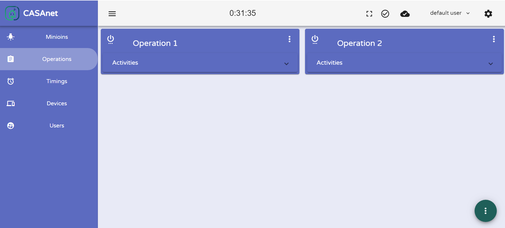
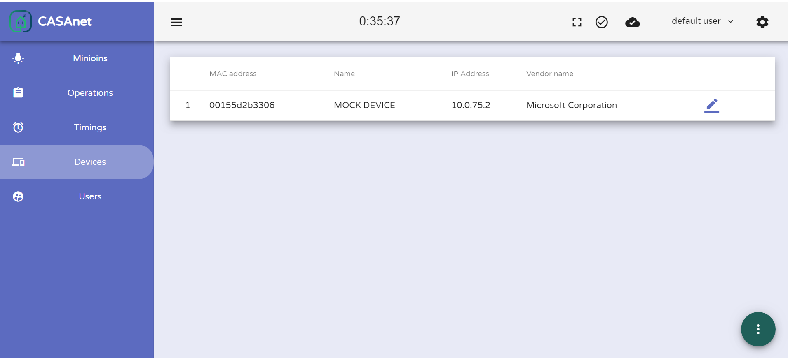
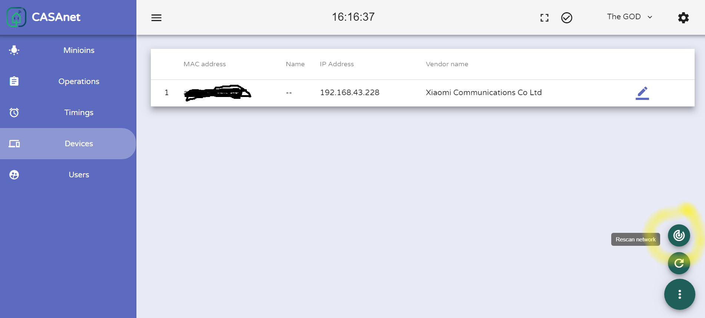
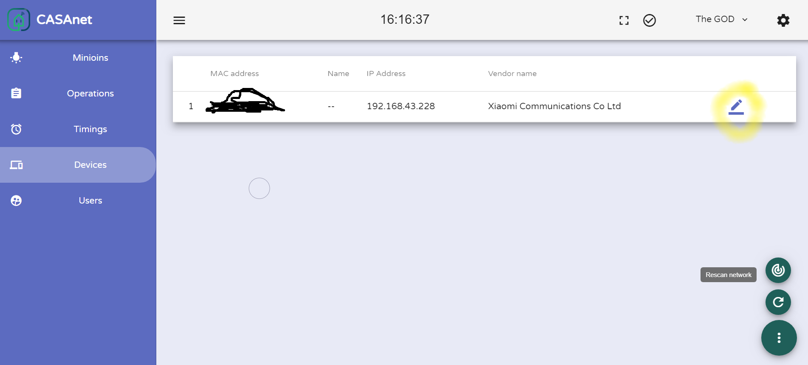
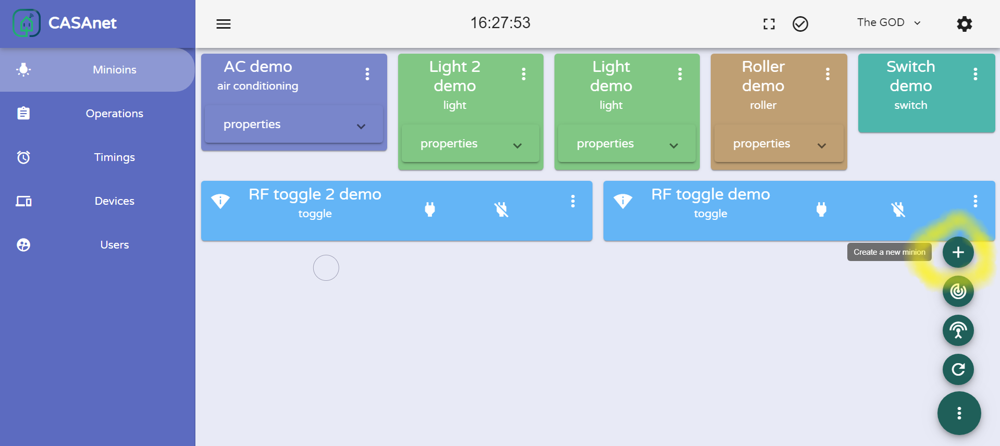
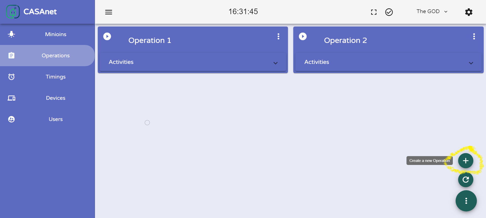
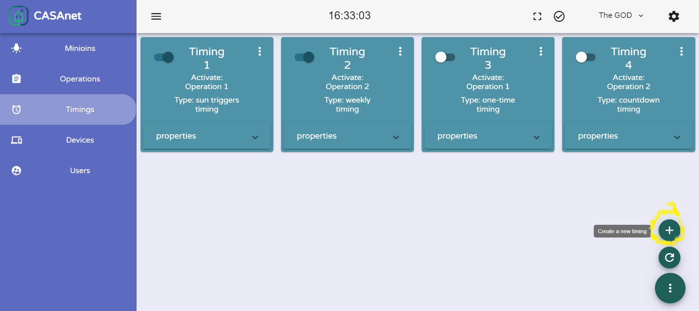

Let's create a smart home, without giving anyone access to our house 😊.

## CASA-NET.
Open-source server to control IoT devices in a local home network.

## Philosophy.
In this project, I came to solve a number of troublesome. first of all, anyone who uses a number of smart devices (smart IR, smart socket, or anything like that) of different companies knows the problem of dealing with a number of different applications,
hold 10 applications for each home appliance that each is completely different in the interface and operations and authentication,
it's a very annoying thing and in addition, the servers, some of which are small Chinese companies, do not always work well, so there is no external access, and there is no normal and clear message about why it does not work.

And the biggest thing is a security issue, I don't want to trust any company code/server in my home. I want to use open-source only. when I can make sure that no one tracks me or any other malicious code runnig in my home. also, I want to block all of my Chinese devices from  communicating any server outside my local network.   

As a solution to these problems this project consolidates all the smart home appliances into one simple and clear and easy to access API.
and it runs on a computer (or any other device that can run node.js, tested on Windows 10 and Linux Ubuntu) at home and does not require connection to the internet to work properly.

The logic and design of the server is that there are several types of devices in the world, such as a lighting device, an AC device etc, and for each physical device its own module that realizes the capabilities that the device of its kind enables,(and the advanced options that each company realizes in a different way like timing, thrown), and on all devices there is a switch component with on\off option.

This structure enables the creation of a separate server and a collection of modules that enable communication by implementing preset methods for each device type (such as the OOP interface).

## How does it look?

Minimal page (only 5 kb of resources should be transferred !!!) for old phones or very slow networks.

Link to the minimal page exist in the settings 'light version' section, or just navigate to `[server-ip/host]/static/light-app/index.html`.

### UI Languages support.
The UI built to be multi-Language support.

Current Languages supported:
* English
* Hebrew

Any support for other languages will be welcome.

## How to use it?
* Run casa-net server in a home network [see documentation](./backend/README.md).
* Run casa-net remote server in cloud service [see documentation](./remote/README.md).

## How to access casanet from wide internet?
The server needs to run on local home network, so how to access it via internet?

#### Method 1: Port forwarding. 
Make sure that the address in your home is public and redirect ports in home router to the computer that running casa-net server.

(DDNS is recommended for easy access to home address).

#### Method 2: Using casa remote server.
The casa remote server is built for it, [casanet-remote](./remote/README.md) run on cloud service and to redirect API requests to the local server.

## Supported right now.

-  Orvibo (aka wiwo)

	-  S20 (socket). [link](https://www.aliexpress.com/item/2016-New-Orvibo-Home-Automation-EU-U-UK-AU-Standard-Smart-Power-Travel-Socket-Plug-4G/32793333967.html)

-  Broadlink

	-  SP3 (socket). [link](https://www.gearbest.com/smart-access-lock/pp_009282693865.html)
	-  RM mini 3 (As AC). [link](https://www.gearbest.com/alarm-systems/pp_009753807797.html)
	-  RM Pro (As AC / RF toggle). [link](https://www.gearbest.com/home-appliances-accessories/pp_009281768756.html)

-  Yeelight

	-  Light with temperature and brightness properties. [link](https://www.gearbest.com/round-ceiling-lights/pp_009555929473.html) and others.
	-  Light with RGBW properties. [link](https://www.gearbest.com/smart-bulbs/pp_009329720794.html) and others.
    
-  Tuya (aka smart life)

	-  Switch (3 or less gangs). [link](https://www.aliexpress.com/item/220V-EU-Standard-3-Gang-Control-LED-Indicate-TUYA-Smart-App-Light-Touch-Switch-work-with/32952608844.html) [link](https://www.aliexpress.com/item/WiFi-Smart-Boiler-Switch-Water-Heater-Smart-Life-Tuya-APP-Remote-Control-Amazon-Alexa-Echo-Google/32981607525.html) and others.
	-  Curtain switch. [link](https://www.aliexpress.com/item/Tuya-Smart-Life-WiFi-Curtain-Switch-for-Electric-Motorized-Curtain-Blind-Roller-Shutter-Google-Home-Amazon/33006009742.html) and others.

- Mi (aka xiaomi)
    
    -  Philips LED Ceiling Lamp. [link](https://www.gearbest.com/smart-ceiling-lights/pp_009933492211.html)
	-  Robot Vacuum. [link](https://www.gearbest.com/robot-vacuum/pp_440546.html)

- Tasmota
    
    - Switch (tested with [this](https://www.gearbest.com/robot-vacuum-accessories/pp_009661965579.html?wid=1433363) and [this](https://www.gearbest.com/alarm-systems/pp_009227681096.html?wid=1433363))

- [IFTTT](https://ifttt.com/discover) module. [module use documentation](./backend/src/modules/ifttt/README.md)..

    - Toggle.
    - Switch.
    
- [MQTT](http://mqtt.org/) module. [module use documentation](./backend/src/modules/mqtt/README.md).
    -  Toggle.
    -  Switch.
    -  Air-conditioning.
    -  Light
    -  Temperature.
    -  Color.
    -  Roller.
    
- Mock (for testing only)
    
    -  Toggle demo.
    -  Switch demo
    -  Air-conditioning demo.
    -  Light demo.
    -  Temperature light demo.
    -  Color light demo.
    -  Roller demo.
    
## Supported soon.

## Adding other devices support.
Yes, it is possible and will be welcome, see [modules](./backend/src/modules/README.md#-for-development-only-).

## Using scenario:
- Buy new [supported](#supported-right-now) smart devices or use the `mock` brand.
- [Connect it to local network](./backend/src/modules/README.md) via official app.
- Scan the local network to find the new device. 
    

    And give a name for the device (optionally).
    

- Create a new minion** from the device.
    

- Say hello to the new minion and change the current status ;)

- Create a new operation.
    

- Create new timing that invoked the created operation
    

- Enjoy.

To watch full API specs use [swagger UI](https://petstore.swagger.io/) and put `https://raw.githubusercontent.com/haimkastner/Home-IoT-Server/master/backend/swagger.yaml` in explorer input.

**
Minion is a logic device in the system, meaning that a device is a physical device and minion is a logic device that uses a physical device to switch home kit status. For example, an IR transmitter can be one physical device for a few minions, one to central AC control and second for secondary AC control so in it will be two totally  different minions that use one physical device.

## IFTTT integration.
The [IFTTT](https://ifttt.com/discover) ecosystem is great ;). 
Now, invoking trigger when a minion turned on/off or turning on/off minion when any IFTTT trigger invoked is possible.

The integration is using [WebHooks](https://ifttt.com/maker_webhooks) API.

Receiving invoked triggers allow only if casa-net server accessible via public internet or via a remote server.

Invoking trigger when a device turned on/off the local server require an internet connection.  

See [step by step instraction](./docs/IFTTT.md) to use IFTTT.

## Main technologies.
* Node.js (TypeScript) - Server.
* Angular (with angular material) - Client.
* API - Swagger.

## TODO:
- [X] Finish UI of casanet local server.
- [ ] Create remote server managments UI.
- [ ] Support RTSP devices. 

For any suggestion or help feel free to contact me.

## Casanet image
Although there is no way to run the server in a docker container because the app should scan the real local network.
I made a Linux image for several devices.
- [Orange Pi One H3 512MB](https://1drv.ms/u/s!AkCfoHMx_LhRrZMxfN_eyA8gHbeALg?e=uHbjTV) based `Armbian_5.83` `Debian_stretch`.
- [Orange Pi Zero H2 512MB](https://1drv.ms/u/s!AkCfoHMx_LhRrZMw26D8_EBF7Arayw?e=oQn15w) based `Armbian_5.83` `Debian_stretch`.
- [Orange Pi Zero H2 512MB](https://1drv.ms/u/s!AkCfoHMx_LhRrZMvMbCzaCZabZIoEg?e=n67UiJ) based `Armbian_5.83` `Debian_stretch`. 
	- (With hotspot SSID:`CASANET` pass: `casanet-is-the-best?`.

Username: `root` \ `casanet` Password: `casa-net`.

All configured to run the server on boot in port 80. 

## Credits
* Logo and UX consulting [Ofek Avergil](https://il.linkedin.com/in/ofek-avergil-348260144).

Shared with 	❤️ 	by kastnet.

---
> The version 1 of the project placed in [here](https://github.com/haimkastner/Home-IoT-Server/tree/archive-v1), maintaining for security and fatal bugs fixes only.
---
