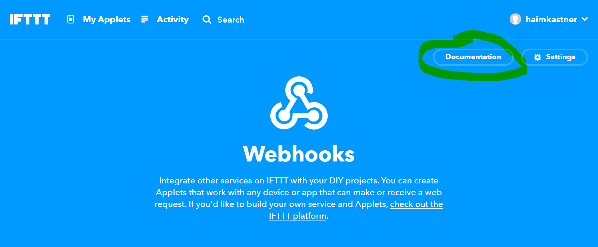
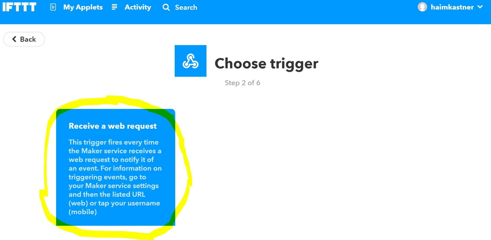
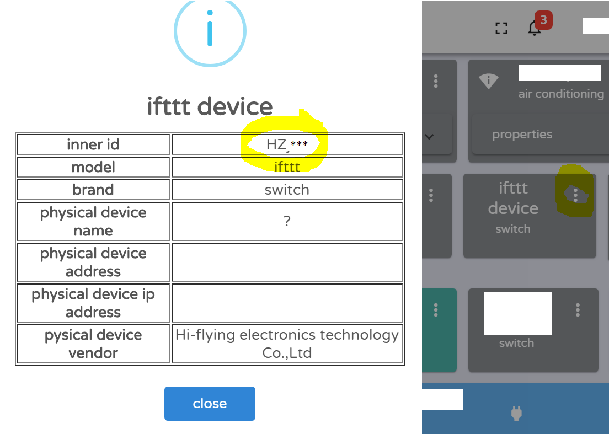
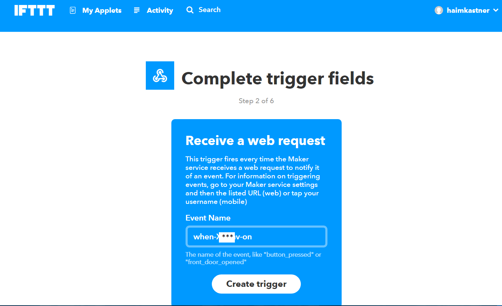
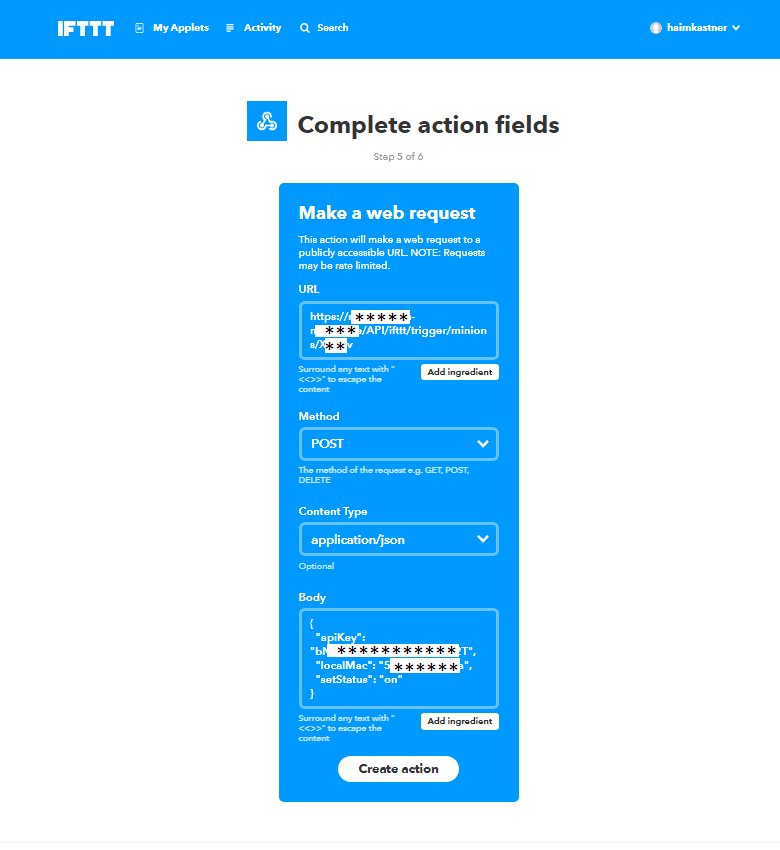
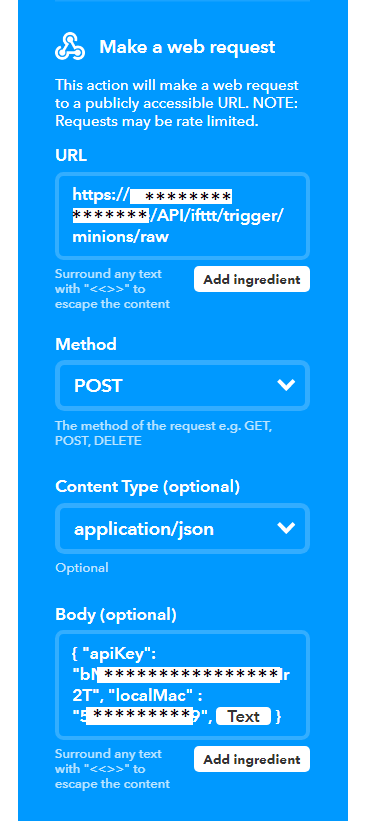
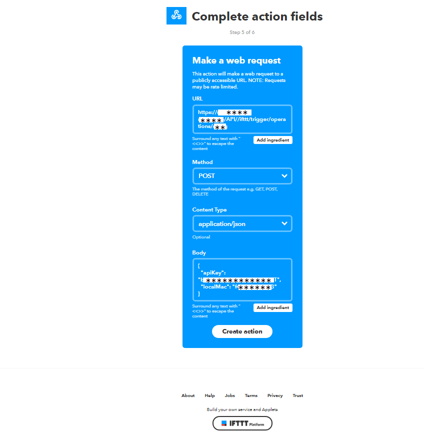

## Philosophy
The IFTTT is great service and integrating it in an IOT server can be wonderful.

All the idea can integrate into a real house,

For example, turn on Air-Conditioner when the weather in the area is above x degrees.
Turn on the boiler when you enter the neighborhood.
And any other great using.


> Note, this is not an Ifttt module to used as device communication API, for this see [ifttt module](../backend/src/modules/README.md#Ifttt-devies)

## Implementation
Currently, the implementation of Ifttt integration is using Ifttt [WebHooks](https://ifttt.com/maker_webhooks).
because implementing of Ifttt service require main host that received Ifttt API calls,
but this project made to be totally in users hands and control. so using webhooks is the best option for it.

## Step by step instructions

### Create Ifttt and WebHooks accounts.
1) Create an [IFTTT](https://ifttt.com/) account or login if already own one.
1) Connect [WebHooks](https://ifttt.com/maker_webhooks) to Ifttt account.
1) Watch and copy the webhooks API key.
    - Go to https://ifttt.com/maker_webhooks and press on `documentation`
        
    - Watch and copy the webhooks API key.
        
1) Login to casa-net as admin and go to settings (small icon in toolbar) and in `IFTTT integration` section press on `configure` and paste the ifttt api key.
       
### Invoke IFTTT trigger when minion turned on/off.
1) Go to [ifttt applets page](https://ifttt.com/my_applets) and press `new applet`.
1) Press on `+this` button.
1) Choose webhooks service. 
    - 
1) Choose the webhooks trigger. 
    - 
1) Get the `inner-id` of a minion.
    - Open a minion menu and select `device meta`, then copy the `inner-id` value.
        
1) In event name put `when` , the `inner-id` of minion and the on/off operation, all divided by `-`, Look like `when-xxxxxx-on`, And press `create trigger`.
    > Example here is for `on` operation, the `off` operation is just the same, but instead of 'on' put 'off'. 
    - 
1) Press on `+that` button and select the Ifttt service and the action that turn the device on.
For example sending phone notification, email alert, or any idea from wide IFTTT ecosystem.
1) Note that the 'webhooks' trigger gives 3 variables to use, with the following values:
    - `value1`: contains the minion display name.
    - `value2`: contains the minion type.
    - `value3`: contains the current detailed minion status.
1) Create the same trigger for `off` operation of a minion.

### Turn on/off minion when IFTTT trigger invoked.
1) Create a trigger to be invoked by any IFTTT trigger service.
1) Select WebHooks as an action service.
    - 
1) Select make request action
    - 
1) Set the HTTP request as following struct:
    - URL: `http://[casa-net server or remote server host/ip]/API/ifttt/trigger/minions/[inner-id]`.
    - Method: `POST`.
    - Content-TypeL `application/json`.
    - Body: 
      ```
      { 
        "localMac":"f4********83",
        "apiKey": "hjg***Webhooks API key***kjh",
        "setStatus": "on" 
      }
      ```
      the localMac field is required only if using remote-server. to get the local-mac-address login as admin, and in side-bar of settings click on `get the local MAC address` button.
     - 

### Turn on/off minion when IFTTT trigger invoked with all data in one line of text.
It is used when the trigger gives only one text variable to pass to action.
for example, SMS service allows passing the text message value to put it in webhooks request.

1) Create a trigger to be invoked by any IFTTT trigger service.
1) Select WebHooks as an action service.
    - 
1) Select make request action
    - 
1) Set the HTTP request as following struct:
    - URL: `http://[casa-net server or remote server host/ip]/API/ifttt/trigger/minions/raw`.
    - Method: `POST`.
    - Content-TypeL `application/json`.
    - Body: 
      ```
      { 
        "localMac":"f4********83",
        "apiKey": "hjg***Webhooks API key***kjh",
        "minionId : "ac**ef",
        "setStatus": "on" 
      }
      ```
      the localMac field is required only if using remote-server. to get the local-mac-address login as admin, and in side-bar of settings click on `get the local MAC address` button.

     - In the example here putting in the body the ingredient `text` of SMS trigger:
        
     - The SMS text message should look like: 
        

### Invoke operation when IFTTT trigger invoked.
1) Create a trigger to be invoked by any IFTTT trigger service.
1) Select WebHooks as an action service.
    - 
1) Select make request action
    - 
1) Set the HTTP request as following struct:
    - URL: `http://[casa-net server or remote server host/ip]/API/ifttt/trigger/operations/[operationId]`.
    - Method: `POST`.
    - Content-TypeL `application/json`.
    - Body: 
      ```
      { 
        "localMac":"f4********83",
        "apiKey": "hjg***Webhooks API key***kjh"
      }
      ```
      the localMac field is required only if using remote-server. to get the local-mac-address login as admin, and in side-bar of settings click on `get the local MAC address` button.
     - 

That's it ;).
